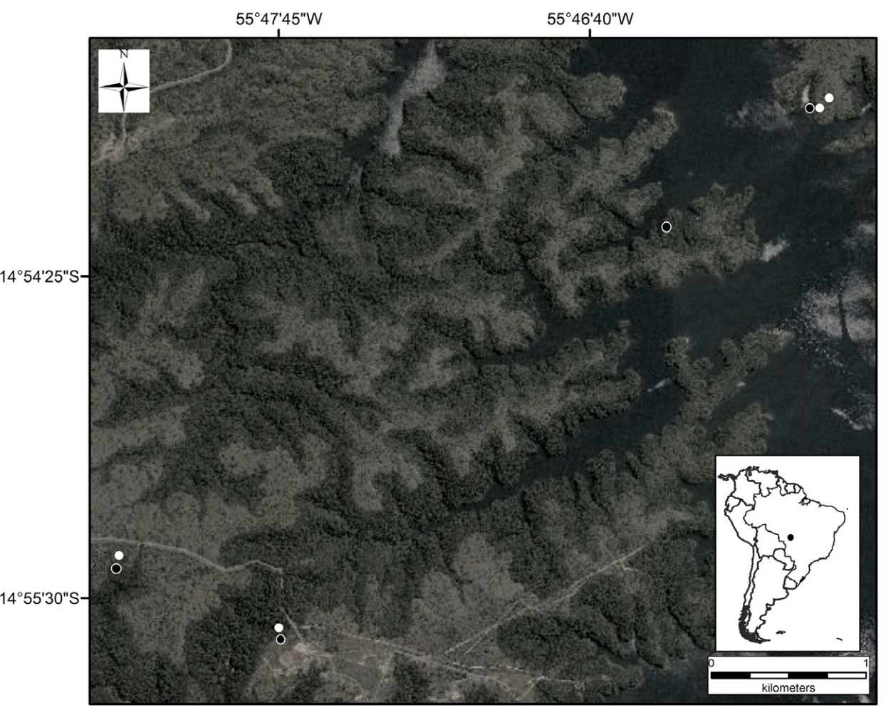
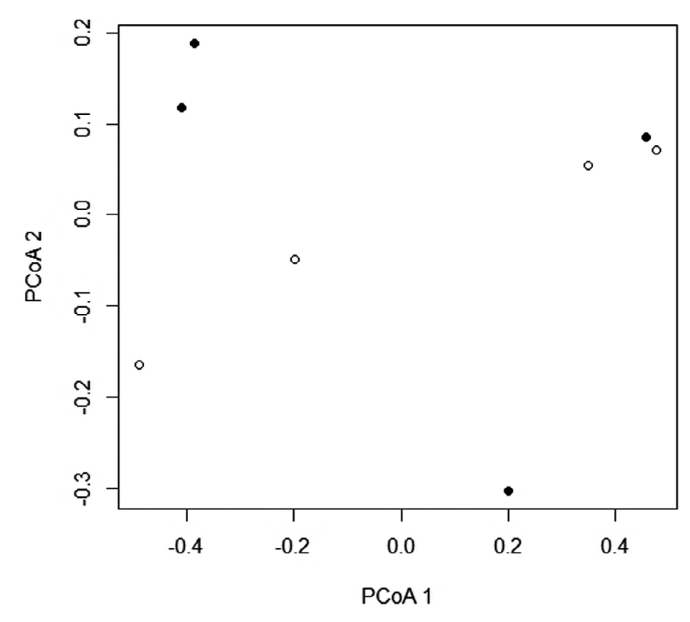

<!-- _paginate: "" -->
<!-- _header:  -->

# Taxonomic, functional, and phylogenetic diversity of lizard assemblages across habitats and seasons in a Brazilian Cerrado area

Raffael Assis Barros, et al., 2022

Presented by Zhehao Hu

---

# What assembles biological communities?
- Structural differences between habitats and seasonal variation, e.g.
    - Vegetation characteristics
    - Microhabitat availability
    - Climatic Condition

<!--
Many can do this.
Habitats, climate, geographic

-> these difference leads to changes
-->

---

# The chain of changes

1. Seasonal variation
2. Changes in environmental conditions
3. Different behavioral and physiological response
4. Defferent **taxonomic**, **functional**, and **phylogenetic** diversity pattern

<!--
Main idea.
-->

---

# Cerrado

- One of the largest and most biodiverse savannas in the world.
- Vegetation heterogeneity (horizontal and vertical)
- Seasonality (precipitation, temperature)

<!--
Cerrado
- 1:savanna
- variance in vegetation, both horizontal and vertical
  - horizontal: different habitats in different region
  - vertical: multiple layers
- seasonality: DS and RS
-->

---

# Campo sujo (CS)

- Higher temperature
- Lower structural heterogeneity
- More stable climate (in evolutional scale)
- More ancestral to local region
- Expected to have higher functional redundancy

<!--
- boring

Functional redundancy:
- e.g. two noctual owls: (noctural predator, owl's hearing and vision, etc.)
- habitats different
-->

---

# <!--fit-->Semi-deciduous forest (SF)

- Lower temperature
- Higher structural heterogeneity (also vertical)
- More distinct ecological niches

which means ...

- Reduction in interspecific competition
- Promote the increase in traits diversity among species
- Lower functional redundancy

---

# Lizard

- Diverse group in Neotropics
- Sensitive to environmental factors
- Lizard assemblages vary in the habitats
    - Species richness
    - Species abundance
    - Species composition
- Both absence and presence of seasonal effect on lizard assemblages were observed

---

# Hypothesis

## 1. Difference between habitats and seasons will influence the ...
- taxonomic diversity (SR)
- functional diversity (SES.FD, FDis, FR)
- phylogenetic diversity (PSV, PSR)

... of the lizard assemblages.

---

# Hypothesis

2. Species compotition of the lizard assemblages differs between habitats, but not between seasons.
3. Species richness (SR), functional redundancy (FR), phylogenetic species richness (PSR) should differ spatially, seasonally and be greater in Campo Sujo.
4. Functional diversity (SES.FD), functional dispersion (FDis), phylogenetic variability (PSV) should differ spatially, seasonally and be greater in forest formation.
5. Lizards in Campo Sujo (mainly during dry season) will cluster functionally and phylogenetically.

---

# Data collection

- May 2000 ~ February 2002
- 4+4 Pitfall traps
    - 22 / 20 / 18 months
- Total sampling effor (bucket days) of 

    - 3894 in CS, 2804 in SF
    - 3562 in DS, 4146 in RS
- tail length, diet, thermoregulatory behaviour, etc.

---

# Maths Magics 🪄✨

## Taxonomic Diversity
- PERMANOVA to compare SC
- PCoA (principal coordinate analysis)

## Functional Diversity
- Functional trait matrix, Dissimilarity Matrix, UPGMA, Functional dendrogram, FD index
- **SES.FD** (Standard effect size of functional diversity)

<!--
SED.FD: Standard effect size of FD
-->

---

# Maths Magics 🪄✨

- GLMM (generalized linear mixed model) for testing habitat differences (SR, FDis, PSR, PSV, FR, SES.FD)
- **Seasonal variation in functional structure**: FD, MPD (mean pair-wise distance), MNTD (mean neares taxon distance)
- **Seasonal varation in phylogenetic structure**: PD, MPD, MNTD
- Significance calculated by comparing to null distribution simulated by 10,000 randomization

---

  

# Results

- 182 lizards
- 14 species (14 in CS, 10 in SF) from 6 families

|        | **CS**                         | **SF**  |
| ------ | -------------------------- | --- |
| **DS** | functionally clustered     |     |
| **RS** | phylogenetically clustered |     |

| Difference          | Habitat | Seasonal |
| ------------------- | ------- | -------- |
| Species richness    | NO      | NO       |
| PSR                 | NO      | NO       |
| PSV                 | NO      | NO       |
| Species composition | YES     | NO       |
| SES.FD              | YES     | NO       |
| FDis                | YES     | NO       |
| FR                  | YES     | NO       |

---

# More heterogeneous habitats harbour greater number of functionally distinct species
- greater number of ecological niches
- different ways to exploit resources
- greater diversification of species' traits
- greater functional dispersion

---

# Greater functional redundancy in Campo Sujo
- increasing temporal stability of the community
- providing protection agaisnt loss of ecosystem functions
- greater resilience against disturbances

---

# Functional clustering in Campo Sujo: dry season
- Due to greater FR
	- reduced FD commonly found in habitats under strong environmental pressure
	- common environmental filters
		- high temperatures, low humidity, scanty vegetation cover, sporadic bushfires

---

# Phylogenetic clustering in Campo Sujo: rain season
- refuted hypothesis
- ca. 75% Lacertoidea
- Seasonality influences their diet, activity, reproduction
- Due to different responses of the species to seasonality

---

<!-- _paginate: "" -->
<!-- _header:  -->

# <!--fit-->Thank you! 

hu_zhehao@hotmail.com 🐊
[github.com/zzzhehao](https://github.com/zzzhehao) 
[bio.site/zhehao.hu](https://bio.site/zhehao.hu)

This presentation is made with Marp: Markdown Presentation Ecosystem.

---

# Questions?
<footer style="font-size:1.7rem;color:white;">Plestiodon stimpsonii | Yaeshima Islands, Okinawa, Japan</footer>

